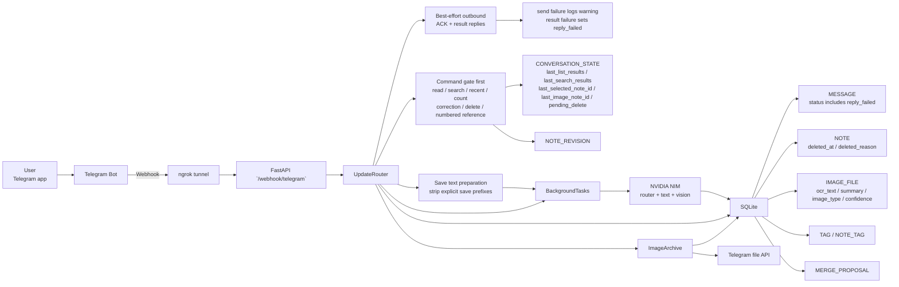
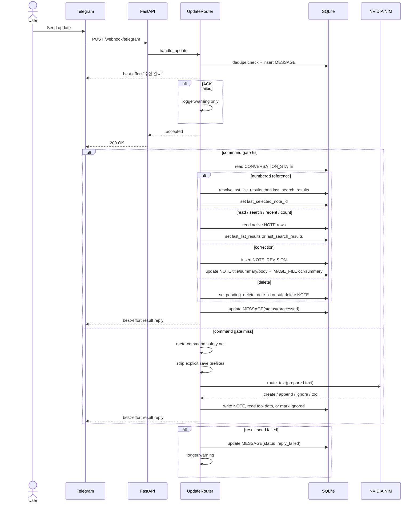
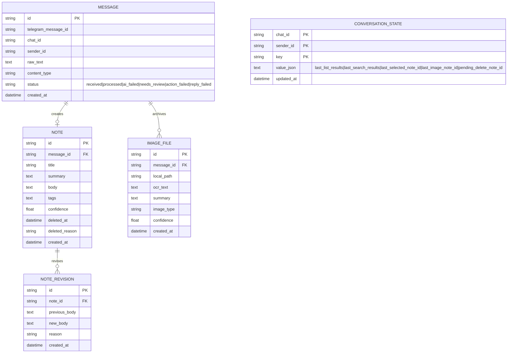
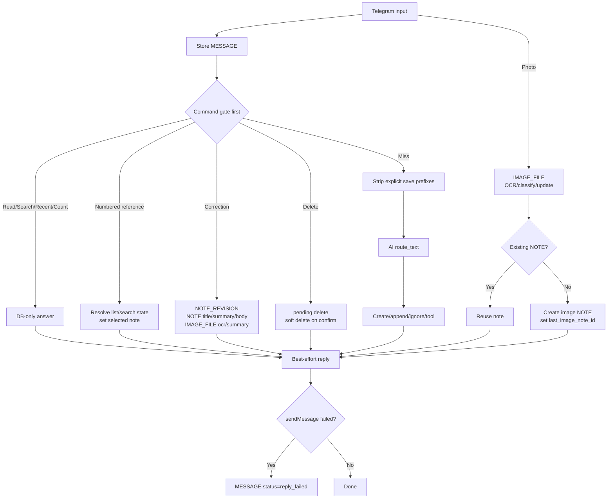

# Architecture

This document reflects the current hybrid implementation:

- Telegram outbound `sendMessage` is best-effort; timeout or HTTP failure must not turn the webhook into HTTP 500.
- Immediate ACK failure is logged only, while MESSAGE storage and background processing continue.
- Result reply failure is logged and recorded as `MESSAGE.status=reply_failed`.
- Deterministic command gate runs before AI routing for read, search, recent, count, correction, delete, and numbered references.
- AI routing is used only after command-gate miss, with a safety net preventing meta commands from becoming NOTE create/append.
- Explicit save prefixes such as `메모로 저장해줘:` are stripped before AI routing and NOTE persistence.
- Correction records `NOTE_REVISION` and can update `NOTE.title`, `NOTE.summary`, `NOTE.body`, `IMAGE_FILE.ocr_text`, and `IMAGE_FILE.summary`.
- Same-chat context remains bounded to 30 minutes for follow-up interpretation.

For raw Mermaid files, see `docs/diagrams/`.

## Current Runtime Architecture

## Current Processing Sequence

## Current Data Shape

## Near-Term Target

