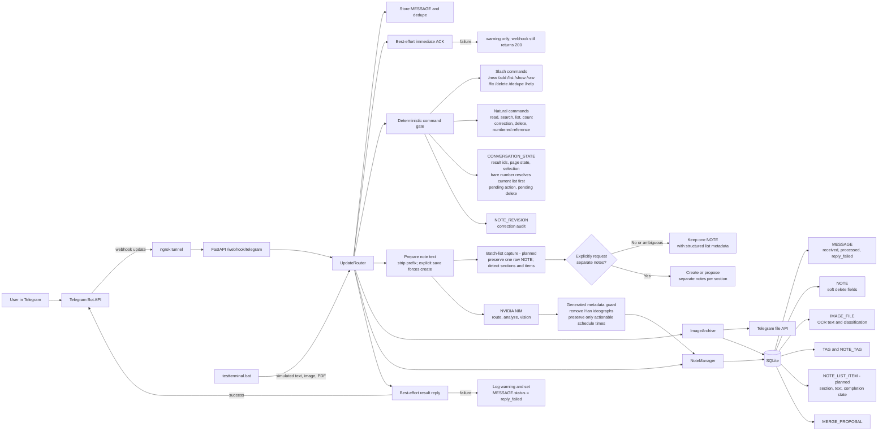
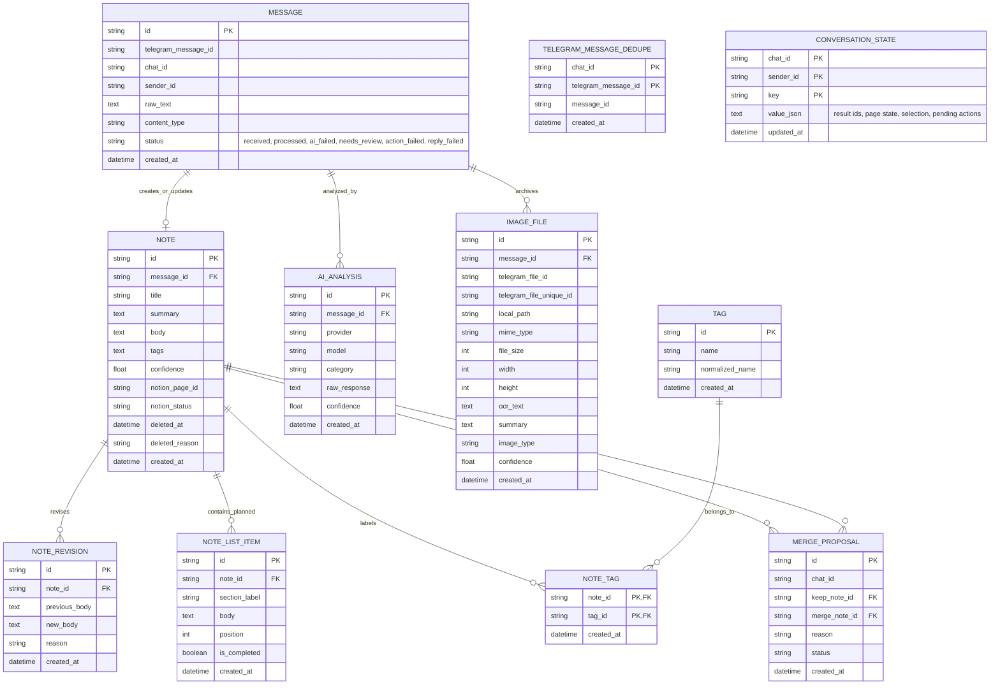
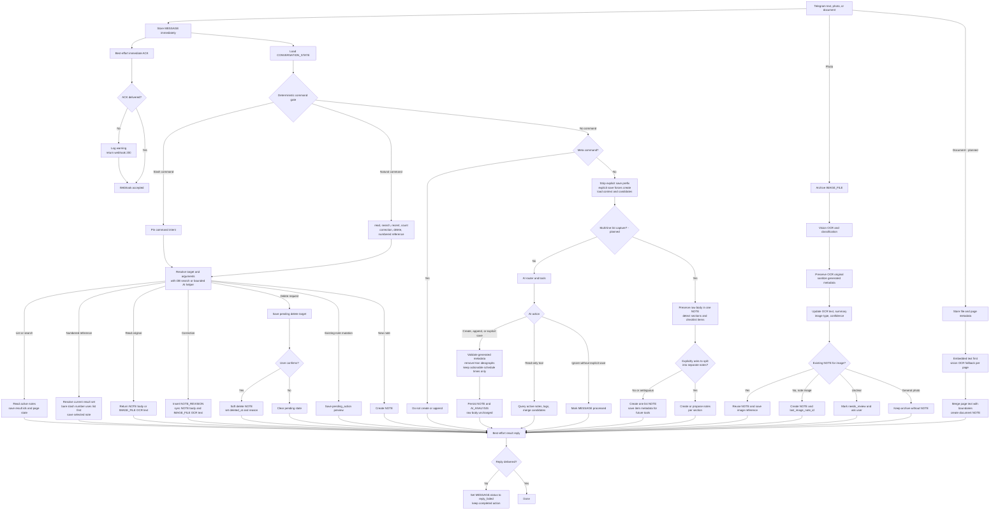

# Architecture

This document reflects the current hybrid implementation:

- Telegram outbound `sendMessage` is best-effort; timeout or HTTP failure must not turn the webhook into HTTP 500.
- Immediate ACK failure is logged only, while MESSAGE storage and background processing continue.
- Result reply failure is logged and recorded as `MESSAGE.status=reply_failed`.
- Deterministic command gate runs before AI routing for read, search, recent, count, correction, delete, and numbered references.
- Target slash-command layer pins command intent while allowing flexible AI/DB-assisted argument resolution. `/new` creates a note; `/add` appends to an existing note.
- Existing-note mutations require approval: `/add`, `/fix`, `/delete`, and `/dedupe` must show a preview or target list before execution.
- Broad list/show results should paginate at 10 items per page and keep page state in `CONVERSATION_STATE`.
- AI routing is used only after command-gate miss, with a safety net preventing meta commands from becoming NOTE create/append.
- Explicit save prefixes are removed before analysis; an explicit save forces NOTE persistence even if AI routing says ignore.
- Planned batch-list capture preserves a multi-line message as one raw NOTE and extracts sections/items; it only splits into separate notes after an explicit user request.
- Bare numeric slash arguments such as `/delete 5` resolve item 5 from `last_list_results` before any previously selected note.
- AI-generated titles, summaries, tags, search answers, and agent answers remove Han ideographs; raw NOTE bodies and OCR text remain unchanged.
- Temporal metadata is promoted only for clear plans, appointments, tasks, or deadlines, not past narrative context such as `3시까지 기다렸다`.
- Correction records `NOTE_REVISION` and can update `NOTE.title`, `NOTE.summary`, `NOTE.body`, `IMAGE_FILE.ocr_text`, and `IMAGE_FILE.summary`.
- Same-chat context remains bounded to 30 minutes for follow-up interpretation.

For raw Mermaid files, see `docs/diagrams/`.

## Current Runtime Architecture



## Current Processing Sequence

```mermaid
sequenceDiagram
    actor U as User
    participant T as Telegram
    participant N as ngrok
    participant A as FastAPI
    participant R as UpdateRouter
    participant D as SQLite
    participant M as NVIDIA NIM

    U->>T: Send text or photo
    T->>N: Webhook request
    N->>A: POST /webhook/telegram
    A->>R: handle_update(update)
    R->>D: Dedupe check

    alt Duplicate update
        R-->>A: ignored
        A-->>T: 200 OK
    else New update
        R->>D: Insert MESSAGE(status=received)
        R->>T: Best-effort sendMessage("Received.")
        alt ACK delivery fails
            R->>R: Log warning only
        end
        R-->>A: accepted
        A-->>T: 200 OK

        par Background processing
            alt Text command gate hit
                R->>D: Load CONVERSATION_STATE
                alt Slash command
                    R->>R: Pin command intent
                    R->>D: Resolve note target and page state
                    Note over R,D: Bare number such as /delete 5 resolves current list item 5 before prior selection
                    alt Existing-note mutation
                        R->>D: Save pending_action preview
                    else List or show
                        R->>D: Save page_state and result ids
                    else New note
                        R->>M: Analyze note text
                        M-->>R: Title, summary, tags
                        R->>R: Remove Han; preserve only actionable schedule times
                        R->>D: Create NOTE
                    end
                else Read, search, recent, count
                    R->>D: Read active NOTE rows
                    R->>D: Save list/search result ids
                else Numbered reference
                    R->>D: Resolve last_list_results, then last_search_results
                    R->>D: Save last_selected_note_id
                else Correction
                    R->>D: Insert NOTE_REVISION
                    R->>D: Update NOTE body and linked IMAGE_FILE OCR text
                else Delete
                    R->>D: Save pending_delete_note_id
                    Note over R,D: Confirmation soft-deletes the NOTE
                end
                R->>D: Mark MESSAGE processed
                R->>T: Best-effort result reply
            else Command gate miss
                R->>R: Reject meta commands from note persistence
                R->>R: Strip explicit save prefix; set force-create flag
                R->>D: Load 30-minute chat context and candidates
                R->>M: Route and analyze text
                M-->>R: create, append, ignore, or tool
                R->>R: Explicit save stays create even if AI route is ignore
                R->>R: Sanitize generated title, summary, tags, and AI answer
                Note over R: Raw NOTE body and OCR text remain unchanged
                R->>D: Persist NOTE or execute read-only tool
                R->>T: Best-effort result reply
            else Photo flow
                R->>D: Insert IMAGE_FILE
                R->>M: OCR and image classification
                M-->>R: OCR text, summary, type, confidence
                R->>R: Preserve OCR text; sanitize generated metadata
                R->>D: Update IMAGE_FILE
                alt NOTE already linked to this image
                    R->>D: Reuse existing NOTE and update reference state
                else Image is a note
                    R->>D: Create NOTE and save last_image_note_id
                else Unclear image
                    R->>D: Mark MESSAGE needs_review
                end
                R->>T: Best-effort image result reply
            end
        end

        alt Result reply delivery fails
            R->>D: Set MESSAGE.status=reply_failed
            R->>R: Log warning; do not roll back action
        end
    end
```

## Current Data Shape



## Near-Term Target


