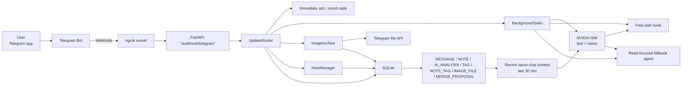
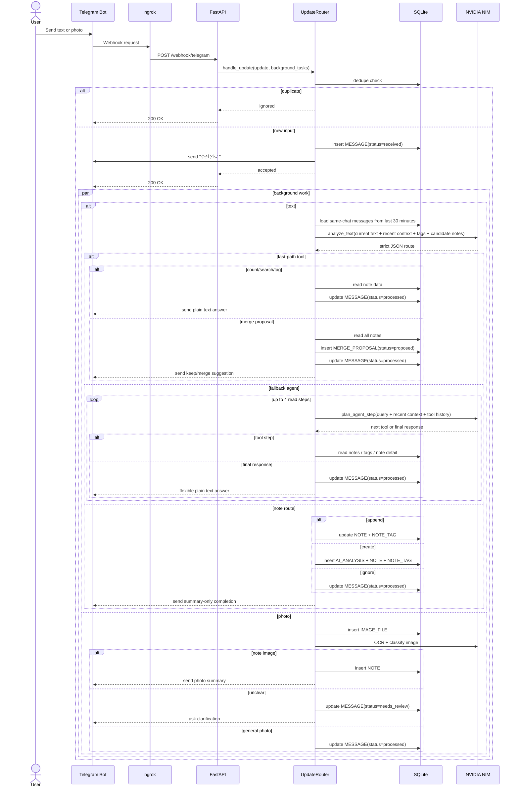
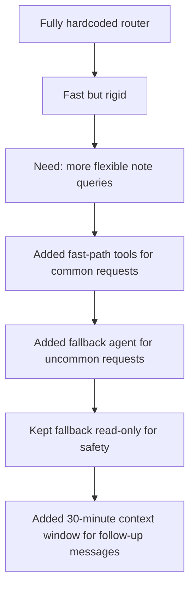
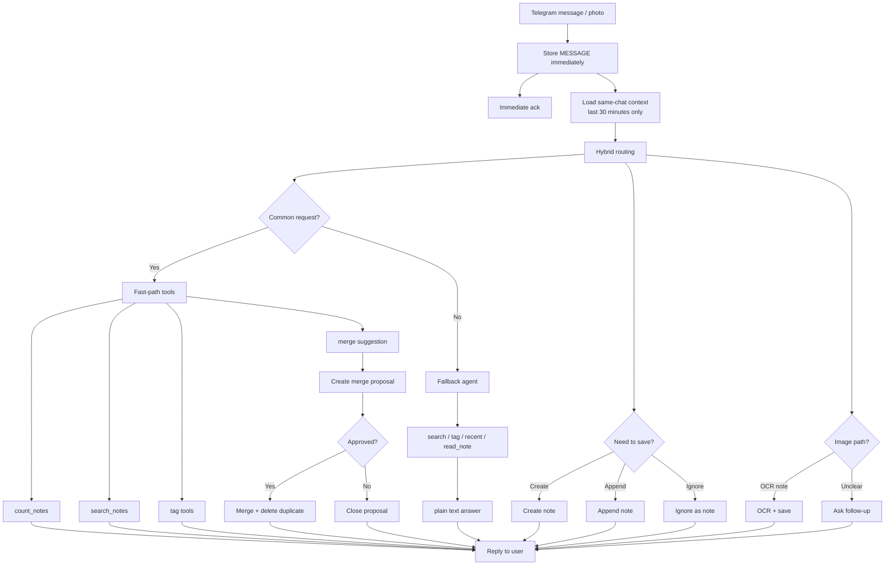

# Architecture

This document reflects the current hybrid implementation: fast-path tools for common note operations, a read-focused fallback agent for unusual note queries, and a 30-minute same-chat context window.

For raw Mermaid files, see `docs/diagrams/`.

## Current Runtime Architecture

## Current Processing Sequence

## Why This Hybrid Shape

## Near-Term Target

