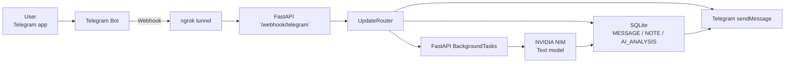
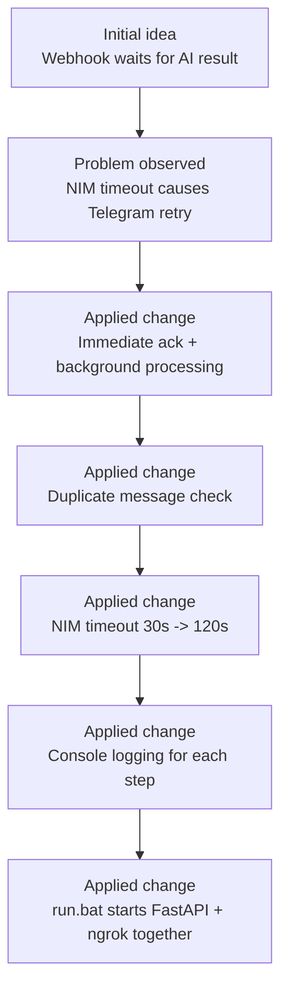
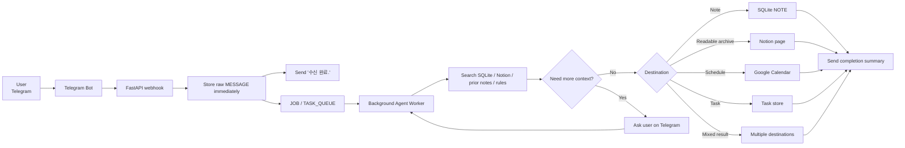
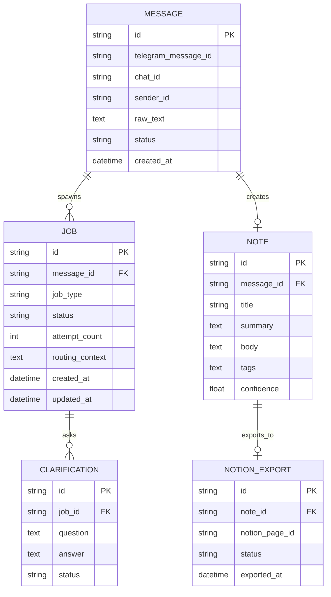

# Architecture

This document reflects both the current implementation and the next target shape of the project.

For raw Mermaid files, see `docs/diagrams/`.

## Current Runtime Architecture

## Current Text Processing Sequence

```mermaid
sequenceDiagram
    actor U as User
    participant T as Telegram Bot
    participant N as ngrok
    participant A as FastAPI
    participant R as UpdateRouter
    participant D as SQLite
    participant M as NVIDIA NIM

    U->>T: Send text
    T->>N: Webhook request
    N->>A: POST /webhook/telegram
    A->>R: handle_update(update, background_tasks)
    R->>D: Check duplicate by chat_id + message_id

    alt Duplicate update
        R-->>A: ignored
        A-->>T: 200 OK
    else New update
        R->>D: Insert MESSAGE(status=received)
        R->>T: sendMessage("수신 완료.")
        R-->>A: accepted
        A-->>T: 200 OK

        par Background processing
            R->>M: Analyze text
            alt NIM success
                M-->>R: title / summary / tags / confidence
                R->>D: Insert AI_ANALYSIS
                R->>D: Insert NOTE
                R->>D: Update MESSAGE(status=processed)
                R->>T: sendMessage("저장했어...")
            else NIM failure or timeout
                R->>D: Update MESSAGE(status=ai_failed)
                R->>T: sendMessage("메시지는 저장했지만 AI 분석에는 실패했어...")
            end
        end
    end
```

## What Changed During Implementation

## Next Target: Agent-Oriented Pipeline

## Recommended Next Schema Expansion

