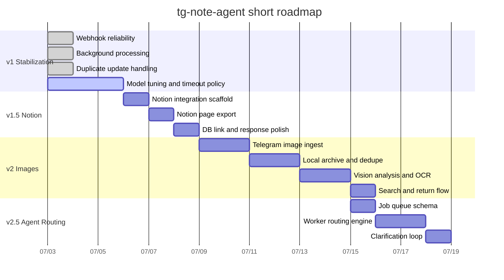

# Roadmap

Base date: `2026-07-03`

This timeline is intentionally short and pragmatic. It is meant to make the next implementation steps easier to resume, not to lock the project into a rigid long-term plan.

## Delivery Phases

1. `v1` stabilize the Telegram text note flow
   Target window: `2026-07-03` to `2026-07-05`
   Scope: webhook stability, duplicate handling, background processing, model tuning, logging

2. `v1.5` add readable note output through Notion
   Target window: `2026-07-06` to `2026-07-08`
   Scope: optional Notion export, `notion_page_id` persistence, Telegram completion message includes Notion status

3. `v2` image note ingestion
   Target window: `2026-07-09` to `2026-07-14`
   Scope: Telegram image receive, local archive, hash dedupe, vision model analysis, OCR/search metadata

4. `v2.5` agent-style routing
   Target window: `2026-07-15` to `2026-07-18`
   Scope: `JOB` queue, worker routing, clarification loop, multi-destination save logic

## Immediate Priority

The next engineering target should be `v1.5`, not `v2`.

Reason:

- It directly solves the current product gap: "stored, but visible in a readable note app"
- It preserves the current SQLite-first architecture
- It gives a cleaner handoff point before image ingestion and OCR complexity

## Mermaid

