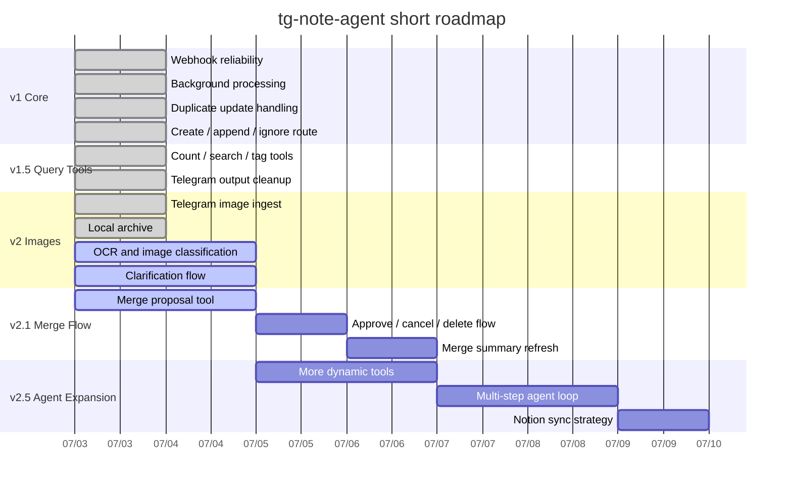

# Roadmap

Base date: `2026-07-03`

This is a short working roadmap for the current Telegram-first note agent.

## Delivery Phases

1. `v1` core webhook + note routing
   Target window: `2026-07-03` to `2026-07-04`
   Scope: immediate ack, duplicate handling, create/append/ignore

2. `v1.5` note query tools
   Target window: `2026-07-03` to `2026-07-04`
   Scope: count/search/tag listing, Telegram plain-text answers

3. `v2` image intake
   Target window: `2026-07-03` to `2026-07-05`
   Scope: photo archive, OCR, note-vs-photo classification, clarification loop

4. `v2.1` merge workflow
   Target window: `2026-07-03` to `2026-07-06`
   Scope: scan all notes, propose merge, approve/cancel, delete merged note

5. `v2.5` agent expansion
   Target window: `2026-07-05` to `2026-07-08`
   Scope: more AI-callable tools, richer multi-step routing, Notion-first sync strategy

## Mermaid

