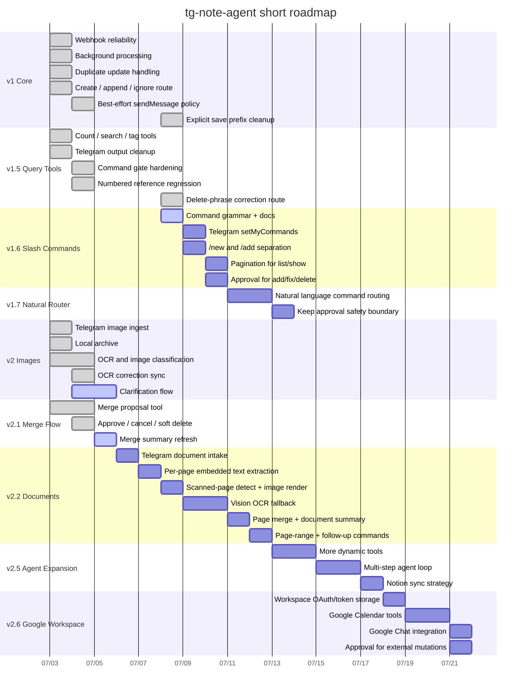

# Roadmap

Base date: `2026-07-03`

This is a short working roadmap for the current Telegram-first note agent.

Current stabilization status: webhook outbound messaging is best-effort, command gate runs before AI save routing, explicit save prefixes are stripped before note persistence, numbered references are backed by conversation state, text/image corrections update the stored note fields, and regression tests cover those paths.

Command UX direction: slash commands should pin intent while leaving arguments flexible. `/new` creates a new note, `/add` appends to an existing note, and existing-note mutations such as `/add`, `/fix`, `/delete`, and `/dedupe` require an approval step. After the slash-command prototype is stable, a natural-language router should map ordinary Korean requests into the same internal command actions without requiring `/`. See `docs/COMMANDS.md`.

## Delivery Phases

1. `v1` core webhook + note routing
   Target window: `2026-07-03` to `2026-07-04`
   Scope: immediate ack, duplicate handling, create/append/ignore

2. `v1.5` note query tools
   Target window: `2026-07-03` to `2026-07-04`
   Scope: count/search/tag listing, Telegram plain-text answers

2.5. `v1.6` slash command UX
   Target window: `2026-07-08` to `2026-07-09`
   Scope: `/new`, `/add`, `/list`, `/show`, `/raw`, `/delete`, `/fix`, `/dedupe`, `/help`; Telegram command menu registration; pagination over 10 results; approval state for mutating existing notes

2.6. `v1.7` natural-language command router
   Target window: after `v1.6`
   Scope: route ordinary Korean requests into internal command actions (`new`, `list`, `show`, `add`, `fix`, `delete`, `dedupe`) while preserving preview/approval for mutations

3. `v2` image intake
   Target window: `2026-07-03` to `2026-07-05`
   Scope: photo archive, OCR, note-vs-photo classification, OCR correction, clarification loop

4. `v2.1` merge workflow
   Target window: `2026-07-03` to `2026-07-06`
   Scope: scan all notes, propose merge, approve/cancel, delete merged note

4.5. `v2.2` document/PDF intake
   Target window: after `v2.1`
   Scope: Telegram document attachments, original file metadata storage, per-page embedded text extraction, scanned-page detection, page image rendering with vision OCR fallback, page-boundary-preserving merge, long-document summarization, page-range processing, and follow-up commands against saved document notes

5. `v2.5` agent expansion
   Target window: `2026-07-05` to `2026-07-08`
   Scope: more AI-callable tools, richer multi-step routing, Notion-first sync strategy

6. `v2.6` Google Workspace integrations
   Target window: after `v2.5`
   Scope: Google Calendar event create/search/update tools, Google Chat notification or command surface, Workspace OAuth/token storage, and approval rules for mutating calendar/workspace data

## Mermaid

